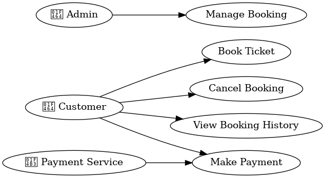

# Requirement Analysis in Software Development

This repository is dedicated to documenting and exploring the concept of *Requirement Analysis* in software development.  

The purpose of this repository is to:  
- Provide insights into the importance of requirement analysis.  
- Explain techniques and tools used in requirement gathering.  
- Serve as a reference for students, developers, and professionals learning about the software development lifecycle.

# What is Requirement Analysis?

Requirement Analysis is the process of identifying, gathering, and documenting the needs and expectations of stakeholders for a software system. It is one of the most critical phases in the Software Development Life Cycle (SDLC), as it lays the foundation for designing, building, and delivering a solution that meets user needs.

### Importance in the SDLC:
1. **Clear Understanding of Needs** – Helps the development team understand *what* the users and business actually require.  
2. **Minimizes Errors** – Detects potential gaps or misunderstandings early, reducing costly fixes later in development.  
3. **Improves Planning** – Provides a basis for project scope, budgeting, scheduling, and resource allocation.  
4. **Ensures Quality** – A well-analyzed set of requirements ensures the final software aligns with stakeholder expectations.  
5. **Facilitates Communication** – Acts as a bridge between stakeholders (clients, users, managers) and developers.

In short, Requirement Analysis ensures that the right problem is being solved in the right way, preventing wasted effort and ensuring project success.

# Key Activities in Requirement Analysis

Requirement Analysis consists of several key activities that ensure software requirements are correctly identified, understood, and documented. These activities guide the development team and stakeholders in building a solution that meets real needs.

- **Requirement Gathering**  
  Collecting information from stakeholders, users, and other sources to identify the needs and expectations for the system. This includes interviews, surveys, observation, and studying existing systems.  

- **Requirement Elicitation**  
  Engaging with stakeholders through discussions, workshops, brainstorming, and prototyping to clarify requirements and uncover hidden needs that may not be obvious initially.  

- **Requirement Documentation**  
  Clearly recording requirements in a structured format (such as Software Requirement Specification – SRS) so they can be referenced throughout the project. Good documentation ensures consistency and avoids misinterpretation.  

- **Requirement Analysis and Modeling**  
  Examining requirements to detect conflicts, redundancies, or gaps. Creating models (like data flow diagrams, UML diagrams, or use cases) to visually represent how the system will function and interact with users.  

- **Requirement Validation**  
  Reviewing requirements with stakeholders and the development team to confirm accuracy, completeness, and feasibility. Validation ensures that the requirements truly reflect user needs and business goals.

# Use Case Diagrams

Use Case Diagrams are a visual modeling tool used in Requirement Analysis to represent the interaction between **actors** (users or external systems) and the **system**. They help in understanding the functional requirements by showing what the system should do from the user’s perspective.

### Benefits of Use Case Diagrams:
- Provide a simple and clear visualization of system functionality.  
- Help identify actors (users or external systems) and their goals.  
- Support communication between stakeholders and developers.  
- Serve as a foundation for writing detailed use cases and scenarios.  

### Example: Booking System Use Case Diagram
The diagram below represents a simplified booking system. It includes actors such as **Customer**, **Admin**, and **Payment Service**, along with use cases like booking tickets, canceling bookings, and processing payments.  

